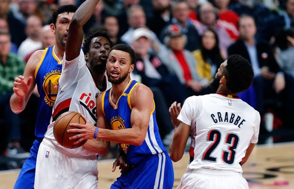
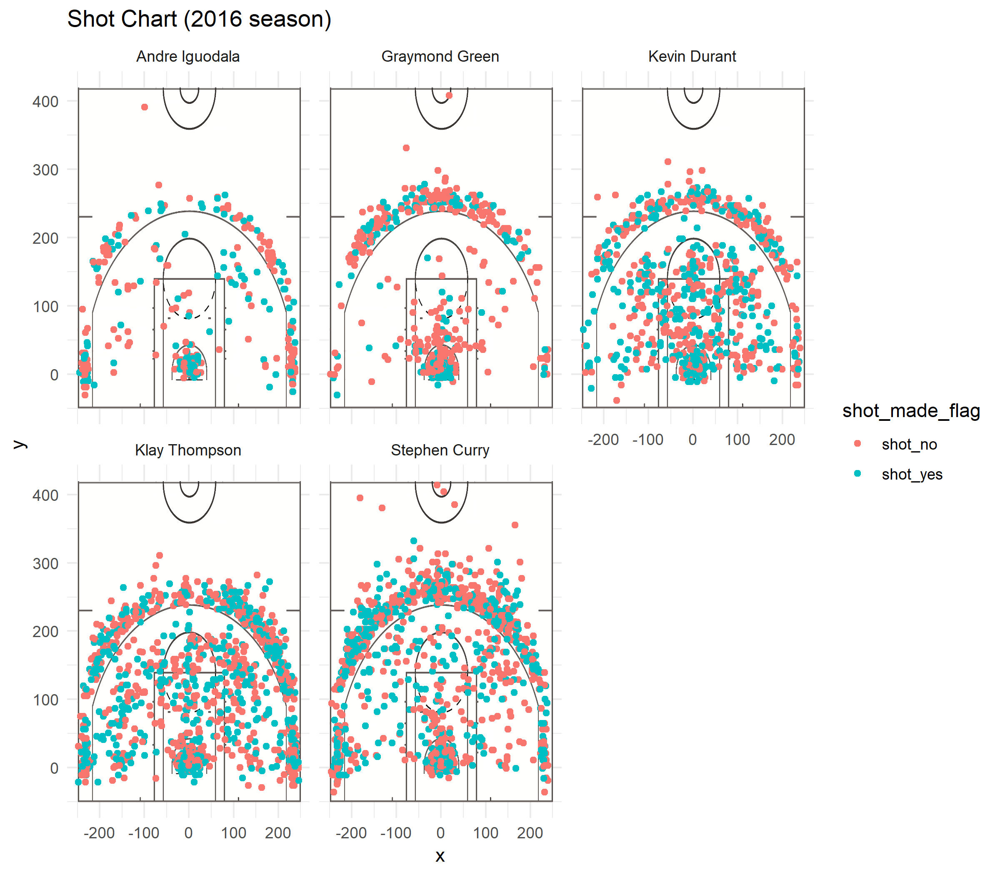
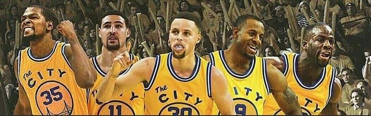

workout01-yunzhe-zhou
================
Yunzhe Zhou

What Factors Will Influence Hit Rate of Warriors ?
==================================================



Key Words
---------

Hit Rate, Shooting Preference, Shooting Position

Introduction
------------

Nowadays, in nba, the hit rates(the percenge of the made shoots in the total shoots) is one of the most essiensial criterials to measure the ability of a player. HOwever, this measurement can sometimes lead to some confusions. For instance, Stephen Curry is undoubtedly the mvp level player in nba and is generally accepted as the lead player in Warriors. On the contrast, Andre Iguodala is less impressive than Curry. However, Iguodala has higher hit rate than Curry in 2016 seasons. Therefore, it is conceivable that the player's ability is not the only factor leading to difference in hit rate. So what are the other factors which also plays a role in it? In this report, we will explore what factors may influence may influence the hit rate of the players in Warriors.

Background
----------

Goldon warriors is now the one of the best teams in nba . Especially, this team has many greatest players which are also in the list of all stars and each one has his own role this team: Stephen Curry, the best point guard and the most talent 3 point shooter in nba. Klay Thompson, great shooter and talent in no-ball running. Kevin Durant, the killer who will always take away the game at the end and all around in every aspects. Graymond Green, the small forward in Warriors and always full of energy with strong body. Andre Iguodala, the role player assisting other lead players in the team.They have different positions, roles and preference for shooting, which might cause some difference in their hit rate besides their own ability.

Discussion
----------

### Shooting Numbers

The following is the shooting plot of the five players during the 2016 season.



We firstly take a look at the total number of shoots in this plot. We can easliy see that Iguodala and Green have less shooting chance than the other players. This may be explained by their role in this team, which is not so important than other players and therefore have less chance in each game. When a team defends another team, it is highly likely that the lead players will be intensily guarded and the role players like Iguodala will be paid less attention to. Therefore, this may lead to his higher hit rate than other lead players. To sum up, the total shooting numbers can represent the role and importance of the player in the team and this may lead to the difference of the hit rate.

### Shooting Preferance

Now, let's focus on the distribution of the plot. From the distribution, we can easily get the shooting preference of each player. For example, as for the plot of Curry, we can easily find that he prefers the 3 point shots a lot. As we all know according to the average data from nba players, the 3 point hit rate is always lower that 2 point hit rates and much lower than the free throw. Therefore, the preferance for the 3 point shots can make the hit rate of Curry relatively lower.This conclusion can be shown by the table in the following.

2 point shots

    ##             name total made perc_made
    ## 1 Andre Iguodala   210  134 0.6380952
    ## 2   Kevin Durant   643  390 0.6065319
    ## 3  Stephen Curry   563  304 0.5399645
    ## 4  Klay Thompson   640  329 0.5140625
    ## 5 Graymond Green   346  171 0.4942197

3 point shots

    ##             name total made perc_made
    ## 1  Klay Thompson   580  246 0.4241379
    ## 2  Stephen Curry   687  280 0.4075691
    ## 3   Kevin Durant   272  105 0.3860294
    ## 4 Andre Iguodala   161   58 0.3602484
    ## 5 Graymond Green   232   74 0.3189655

total shots

    ##             name total made perc_made
    ## 1   Kevin Durant   915  495 0.5409836
    ## 2 Andre Iguodala   371  192 0.5175202
    ## 3  Klay Thompson  1220  575 0.4713115
    ## 4  Stephen Curry  1250  584 0.4672000
    ## 5 Graymond Green   578  245 0.4238754

From the tables, we can verify that there is a big difference for the hits rate between the 2 and 3 point shots. Also, Curry rank 2 and Iguodala rank 4 for the 3 point shots but iguodala has higher hit rate in total shots. THerefore, the shooting preferance plays a great role in influencing the player's hit rates. As for Durant, we can see from the plot that he doesn't have an obvious shooting preferance so he is also called as all-round player. From the total shots table, we can get that he ranks the first and has the highest hit rate. So we can not deny the fact that the all-round preferance of Durant contribute to his higher hit rates. As for Green, he is actually not a very good shooter and he performs bad in both 2 point shots and 3 points shots, so it is not a surprise that he ranks the lowest. Actually, he plays a more important role in defending than getting scores.

There is also a phenomenon called extreme shooting choice, which refers to that the player make some crazy shooting choice like having a "4" point shot from the center of field. Take a look at the plot of Curry, we can see some records of this kind of shots. It looks crazy and for most times it fails. So this kind of crazy preferance can actually decrease his hit rate. From the plot of Curry, it shows about seven to eight extreme shooting choices and all of them make no hits. Also, most of his 3 point shootings have a longer distance than the other player. He always chooses to shoot some inches away from the 3 point circle which will increase the difficulty of the shooting.

To sum up, the preferance for 3 point shots and extreme shooting choice would make players have relatively lower hit rate compared with their ability. This can be easily explained by the plot and table above.

### Position of the Players

As we all know, there are five kind of positions in nba: Center, Power Forward, Small Forward, Shooting Guard, Point Guard. The Center, Power Forward and Small forward always have more chances to make 2 point shoots and Shooting Guard and Point Guard prefer to make more 3 point shoots.Especially, whem the Center makes a shot, he is always very close to the basket so it is not surprising that many players in the position of Center tend to have very high hit rate which is even nearly 90% in some specific game. From the plot, we can easily get that Curry and Thompson are in the position of guard which makes it more difficult for them to make some scores and leads to relatively lower hit rates.



Conclusion
----------

From the data of the plot and tables, we can analyze them and get the conclusion that the hit rate is not only influenced by the ability of the players and it is also influenced by the role, positon and the shooting preferance of the player. Therefore, merely using the hit rates to measure the ability of a player is not feasible. We should mearsure a player in many different apects so that we can have a object judgement of a player.

Take Home Message
-----------------

*Ability is not the only factor influence the hit rate, we should also take the position, shooting preferance and player's role into account.*

Appendix
--------

The code is shown is this part:

``` r
table=read.csv("../data/shots-data.csv")
library(data.table)
library(dplyr)
n=length(table$team_name)
total=c()
made=c()
player_name=c("Stephen Curry","Klay Thompson","Kevin Durant","Graymond Green","Andre Iguodala")
for(m in 1:5)
{
  total[m]=0
  made[m]=0
  for(i in 1:n)
{
  if(table$name[i]==player_name[m] & table$shot_type[i]=="2PT Field Goal")
  {
    total[m]=total[m]+1
    if(table$shot_made_flag[i]=="shot_yes")
    {
      made[m]=made[m]+1
    }
  }
}
}
perc=made/total
table1=data.table(player_name,total,made,perc)
colnames(table1)=c("name","total","made","perc_made")
library(data.table)
library(dplyr)
n=length(table$team_name)
total=c()
made=c()
player_name=c("Stephen Curry","Klay Thompson","Kevin Durant","Graymond Green","Andre Iguodala")
for(m in 1:5)
{
  total[m]=0
  made[m]=0
  for(i in 1:n)
{
  if(table$name[i]==player_name[m] & table$shot_type[i]=="3PT Field Goal")
  {
    total[m]=total[m]+1
    if(table$shot_made_flag[i]=="shot_yes")
    {
      made[m]=made[m]+1
    }
  }
}
}
perc=made/total
table2=data.table(player_name,total,made,perc)
colnames(table2)=c("name","total","made","perc_made")
library(data.table)
library(dplyr)
n=length(table$team_name)
total=c()
made=c()
player_name=c("Stephen Curry","Klay Thompson","Kevin Durant","Graymond Green","Andre Iguodala")
for(m in 1:5)
{
  total[m]=0
  made[m]=0
  for(i in 1:n)
{
  if(table$name[i]==player_name[m] & (table$shot_type[i]=="2PT Field Goal" | table$shot_type[i]=="3PT Field Goal"))
  {
    total[m]=total[m]+1
    if(table$shot_made_flag[i]=="shot_yes")
    {
      made[m]=made[m]+1
    }
  }
}
}
perc=made/total
table3=data.table(player_name,total,made,perc)
colnames(table3)=c("name","total","made","perc_made")
table1=arrange(table1,desc(perc_made))
table2=arrange(table2,desc(perc_made))
table3=arrange(table3,desc(perc_made))
```
